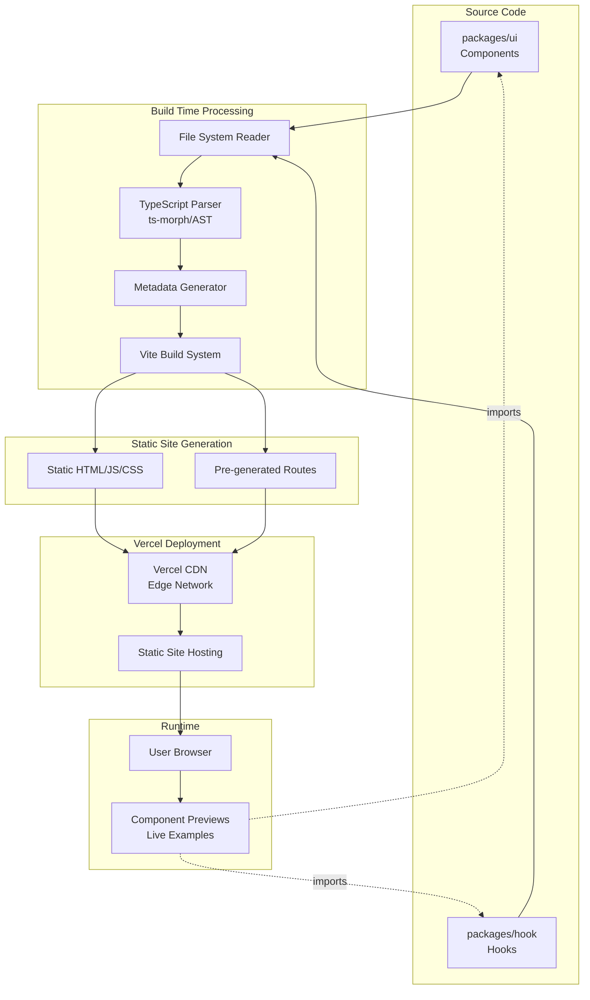

# Documents Fullstack Architecture Document

**Project Name:** Documents  
**Document Version:** 1.0  
**Date:** 2024-12-19  
**Prepared By:** 🏗️ Architect Winston  
**Status:** Draft  
**Related Documents:** [PRD](./prd.md), [Project Brief](./brief.md)

---

## Introduction

This document outlines the complete fullstack architecture for Documents, including backend systems, frontend implementation, and their integration. It serves as the single source of truth for AI-driven development, ensuring consistency across the entire technology stack.

This unified approach combines what would traditionally be separate backend and frontend architecture documents, streamlining the development process for modern fullstack applications where these concerns are increasingly intertwined.

**Note:** While Documents is primarily a static frontend application with build-time processing, this architecture document provides comprehensive coverage of all technical aspects, including build-time systems, data extraction pipelines, and deployment infrastructure.

### Starter Template or Existing Project

**N/A - Greenfield project**

This is a new application within the existing monorepo structure. The project will leverage the existing Turborepo monorepo setup, shared TypeScript configurations, and existing packages (`@monorepo/ui`, `@monorepo/hook`), but the Documents application itself is a greenfield implementation.

### Change Log

| Date       | Version | Description                   | Author            |
| ---------- | ------- | ----------------------------- | ----------------- |
| 2024-12-19 | 1.0     | Initial architecture document | Architect Winston |

---

## High Level Architecture

### Technical Summary

Documents is a static documentation site built with Vite + React + TypeScript that automatically generates documentation from TypeScript source code in the monorepo. The application uses a **Jamstack architecture** with **build-time static site generation** for optimal performance. The frontend application reads component and hook source files from `packages/ui` and `packages/hook` at build time, extracts metadata and TypeScript type information using AST parsing, and generates a static site with visual previews, props tables, and code examples. The application integrates with existing monorepo packages (`@monorepo/ui`, `@monorepo/hook`) for live component previews and deploys as a static site on Vercel, aligning with the existing deployment infrastructure. This architecture achieves PRD goals of zero-runtime dependencies, automatic documentation generation, and excellent performance through static site generation.

### Platform and Infrastructure Choice

Based on PRD requirements, existing monorepo infrastructure, and technical constraints, the platform recommendation is:

**Recommended Platform: Vercel**

**Rationale:**

1. **Existing Infrastructure Alignment**: The monorepo already uses Vercel for deployment (portfolio, assistant-ai apps are deployed on Vercel)
2. **Static Site Optimization**: Vercel excels at static site hosting with automatic CDN distribution, edge caching, and optimal performance
3. **Monorepo Integration**: Vercel has excellent Turborepo support with built-in monorepo detection and optimized builds
4. **Build-Time Processing**: Vercel's build environment supports Node.js APIs needed for file system reading and TypeScript parsing at build time
5. **Zero Configuration**: Static sites deploy automatically with minimal configuration
6. **Cost-Effective**: Free tier is sufficient for documentation sites with high traffic limits

**Alternative Options Considered:**

1. **Netlify**
   - Pros: Excellent static site hosting, good build plugins
   - Cons: Requires additional configuration, team already uses Vercel

2. **AWS S3 + CloudFront**
   - Pros: Full control, enterprise-grade
   - Cons: Higher operational overhead, manual CDN configuration, not aligned with current infrastructure

**Platform:** Vercel  
**Key Services:**

- Static Site Hosting with CDN
- Build System (Node.js build environment)
- Automatic HTTPS
- Edge Network (global CDN)

**Deployment Host and Regions:**

- Primary: Vercel Edge Network (global distribution)
- Build Region: US (default, or closest to repository)

### Repository Structure

**Structure:** Monorepo (existing Turborepo structure)

**Monorepo Tool:** Turborepo (already configured)

**Package Organization:**

- New app: `apps/documents/` - Vite + React application
- Shared packages: Leverages existing `packages/ui` and `packages/hook`
- Build tooling: Uses existing shared configs from `toolings/` (TypeScript, ESLint, Prettier, Tailwind)
- Integration: Documents app imports components/hooks from shared packages for previews

**Rationale:**

- Leverages existing monorepo structure and tooling
- Maintains consistency with other apps in the monorepo
- Enables code sharing and type safety across packages
- Turborepo provides optimized builds and caching for faster development cycles

### High Level Architecture Diagram



### Architectural Patterns

- **Jamstack Architecture:** Static site generation with build-time data processing - _Rationale:_ Optimal performance, security (no server vulnerabilities), scalability, and cost-effectiveness for documentation sites. Content is pre-rendered at build time, eliminating runtime database queries and server processing.

- **Component-Based UI:** Reusable React components with TypeScript - _Rationale:_ Maintainability, type safety, and consistency with existing monorepo packages. Components from `@monorepo/ui` are reused for the documentation site UI, creating a cohesive design system.

- **Build-Time Data Extraction:** File system reading and TypeScript parsing at build time - _Rationale:_ Zero runtime dependencies, better performance (no API calls), and automatic synchronization with source code. Documentation stays current as code changes, with no manual updates required.

- **Static Site Generation (SSG):** Pre-rendering all pages at build time - _Rationale:_ Fast page loads, excellent SEO, reduced server costs, and optimal CDN caching. All component documentation pages are generated once during build and served as static HTML.

- **Monorepo Package Integration:** Direct imports from shared packages - _Rationale:_ Type safety across packages, code reusability, and single source of truth. Component previews use actual components from `@monorepo/ui`, ensuring accuracy and reducing duplication.

- **Progressive Enhancement:** Core functionality works without JavaScript, enhanced with interactivity - _Rationale:_ Accessibility, SEO benefits, and graceful degradation. Search and navigation work with server-rendered HTML, with JavaScript enhancing the experience.

---

## Tech Stack

This section defines the definitive technology selection for the entire project. This table serves as the single source of truth - all development must use these exact versions.

| Category                     | Technology                    | Version  | Purpose                                           | Rationale                                                                              |
| ---------------------------- | ----------------------------- | -------- | ------------------------------------------------- | -------------------------------------------------------------------------------------- |
| Frontend Language            | TypeScript                    | 5.5+     | Type-safe JavaScript development                  | Type safety essential for parsing TypeScript code and maintaining large codebase       |
| Frontend Framework           | React                         | 18+      | UI framework for building component documentation | Industry standard, excellent ecosystem, supports component previews                    |
| UI Component Library         | shadcn/ui                     | Latest   | Dashboard layout and UI components                | Already specified in PRD, provides accessible components, works with Tailwind CSS      |
| CSS Framework                | Tailwind CSS                  | 3.4+     | Utility-first CSS framework                       | Works seamlessly with shadcn/ui, fast development, excellent performance               |
| Build Tool                   | Vite                          | 5+       | Build tool and dev server                         | Fast HMR, optimized builds, excellent plugin ecosystem for build-time processing       |
| Routing                      | React Router                  | 6+       | Client-side routing                               | Mature, well-documented, excellent TypeScript support, aligns with PRD choice          |
| State Management             | React Context + Hooks         | Built-in | Local component state and shared state            | No complex global state needed for documentation site, React built-ins sufficient      |
| Code Highlighting            | Shiki                         | Latest   | Syntax highlighting for code blocks               | Better accuracy than Prism.js, supports VS Code themes, TypeScript-friendly            |
| TypeScript Parsing           | ts-morph                      | Latest   | AST parsing for props extraction                  | Easier API than TypeScript compiler API, better developer experience for code analysis |
| Bundler                      | Vite (Rollup)                 | 5+       | Production code bundling                          | Built into Vite, no separate bundler needed                                            |
| Testing Framework (Frontend) | Vitest                        | Latest   | Unit and component testing                        | Vite-native, fast, excellent TypeScript support, aligns with Vite ecosystem            |
| Testing Library              | React Testing Library         | Latest   | React component testing utilities                 | Industry standard, encourages best practices, accessible testing patterns              |
| E2E Testing                  | Playwright                    | Latest   | End-to-end testing                                | Modern alternative to Cypress, better performance, excellent debugging tools           |
| Package Manager              | pnpm                          | Latest   | Dependency management                             | Already used in monorepo, efficient disk usage, fast installs                          |
| Monorepo Tool                | Turborepo                     | Latest   | Monorepo build system and caching                 | Already configured in project, provides optimized builds and caching                   |
| CI/CD                        | GitHub Actions                | Latest   | Continuous integration and deployment             | Standard for GitHub repositories, integrates with Vercel deployment                    |
| Deployment Platform          | Vercel                        | Latest   | Static site hosting and CDN                       | Already used in monorepo, excellent static site support, automatic deployments         |
| Monitoring                   | Vercel Analytics              | Latest   | Web analytics and performance monitoring          | Built into Vercel, provides Core Web Vitals and usage analytics                        |
| Logging                      | Browser Console + Vercel Logs | Built-in | Error tracking and debugging                      | Simple approach for static site, Vercel provides build and runtime logs                |
| Database                     | None                          | N/A      | No database required                              | Static site with build-time data generation, no runtime data storage                   |
| Cache                        | Vercel Edge Cache             | Built-in | CDN caching for static assets                     | Automatic with Vercel deployment, no configuration needed                              |
| File Storage                 | File System (build-time)      | N/A      | Source code reading                               | Files read at build time, no runtime file storage needed                               |
| Authentication               | None                          | N/A      | No authentication required                        | Public documentation site as per PRD requirements                                      |

---

## Data Models

The data models represent the metadata structures used to organize and display component and hook documentation. These are TypeScript interfaces that will be shared across the build-time processing pipeline and the frontend application.

### Component Metadata

**Purpose:** Represents metadata for a UI component extracted from source code, including props information, source location, and categorization.

**Key Attributes:**

- `id`: `string` - Unique identifier (component name in kebab-case)
- `name`: `string` - Component display name (PascalCase)
- `description`: `string | null` - Component description from JSDoc comments
- `category`: `string` - Category classification (Form, Layout, Feedback, Data Display, Navigation, Uncategorized)
- `package`: `'ui'` - Source package identifier
- `filePath`: `string` - Relative path to component source file
- `props`: `ComponentProp[]` - Array of prop definitions extracted from TypeScript interface
- `sourceCode`: `string` - Full component source code
- `examples`: `string[]` - Usage example code snippets (optional)

**TypeScript Interface:**

```typescript
interface ComponentMetadata {
  id: string;
  name: string;
  description: string | null;
  category: string;
  package: "ui";
  filePath: string;
  props: ComponentProp[];
  sourceCode: string;
  examples?: string[];
  tags?: string[];
}

interface ComponentProp {
  name: string;
  type: string;
  description: string | null;
  required: boolean;
  defaultValue?: string | null;
}
```

**Relationships:**

- Belongs to a category (many-to-one)
- Has multiple props (one-to-many)
- References source file in `packages/ui` package

### Hook Metadata

**Purpose:** Represents metadata for a React hook extracted from source code, including parameters, return values, and usage examples.

**Key Attributes:**

- `id`: `string` - Unique identifier (hook name in kebab-case)
- `name`: `string` - Hook display name (camelCase with 'use' prefix)
- `description`: `string | null` - Hook description from JSDoc comments
- `category`: `string` - Category classification (Client-side, Utilities)
- `package`: `'hook'` - Source package identifier
- `filePath`: `string` - Relative path to hook source file
- `parameters`: `HookParameter[]` - Array of parameter definitions
- `returns`: `HookReturn` - Return value type and description
- `sourceCode`: `string` - Full hook source code
- `examples`: `string[]` - Usage example code snippets (optional)

**TypeScript Interface:**

```typescript
interface HookMetadata {
  id: string;
  name: string;
  description: string | null;
  category: string;
  package: "hook";
  filePath: string;
  parameters: HookParameter[];
  returns: HookReturn;
  sourceCode: string;
  examples?: string[];
  tags?: string[];
}

interface HookParameter {
  name: string;
  type: string;
  description: string | null;
  required: boolean;
  defaultValue?: string | null;
}

interface HookReturn {
  type: string;
  description: string | null;
}
```

**Relationships:**

- Belongs to a category (many-to-one)
- Has multiple parameters (one-to-many)
- References source file in `packages/hook` package

### Documentation Index

**Purpose:** Aggregates all component and hook metadata for efficient search and navigation. Generated at build time and embedded in the static site.

**TypeScript Interface:**

```typescript
interface DocumentationIndex {
  components: ComponentMetadata[];
  hooks: HookMetadata[];
  categories: {
    components: Record<string, string[]>; // category -> component IDs
    hooks: Record<string, string[]>; // category -> hook IDs
  };
  generatedAt: string; // ISO timestamp
  version: string; // Build version or commit hash
}
```

**Relationships:**

- Contains all components (one-to-many)
- Contains all hooks (one-to-many)
- Organizes items by category (many-to-many via categories map)

---

## API Specification

**Not Applicable** - Documents is a static site with no runtime API endpoints. All data is generated at build time and embedded in the static site. The application uses client-side routing via React Router for navigation, but all data is pre-rendered and served as static HTML/JSON.

**Data Access Pattern:**

- Build-time: File system reading and TypeScript parsing generates static JSON files
- Runtime: Static JSON files are embedded in the application bundle or loaded as static assets
- No server-side API or database queries are performed at runtime

---

## Components

This section identifies the major logical components/services across the application.

### Build-Time Processing Pipeline

**Responsibility:** Extracts metadata from source files, parses TypeScript types, and generates documentation data structures.

**Key Interfaces:**

- `FileSystemReader`: Reads component/hook source files from monorepo packages
- `TypeScriptParser`: Parses TypeScript interfaces to extract props/parameters
- `MetadataGenerator`: Combines parsed data into metadata structures
- `IndexGenerator`: Creates searchable documentation index

**Dependencies:**

- File system access to `packages/ui` and `packages/hook`
- TypeScript parser (ts-morph)
- Vite build system

**Technology Stack:** Node.js, ts-morph, Vite plugins

### Frontend Application

**Responsibility:** Renders documentation UI, handles routing, displays component previews, and provides search functionality.

**Key Interfaces:**

- Component listing pages with filtering and search
- Component detail pages with preview, props table, and source code
- Hook listing and detail pages
- Navigation sidebar and breadcrumbs
- Search functionality

**Dependencies:**

- React Router for navigation
- shadcn/ui components for UI
- Component previews require `@monorepo/ui` and `@monorepo/hook` imports
- Documentation index (generated at build time)

**Technology Stack:** React 18+, React Router 6+, shadcn/ui, Tailwind CSS

### Component Preview System

**Responsibility:** Renders live React components for visual previews in documentation.

**Key Interfaces:**

- `PreviewContainer`: Wrapper component that renders component examples
- Context providers setup for components requiring providers
- State management for interactive component previews

**Dependencies:**

- `@monorepo/ui` package for component imports
- React runtime for rendering
- May require context providers (ThemeProvider, etc.)

**Technology Stack:** React 18+, TypeScript

---

## Frontend Architecture

### Component Architecture

**Component Organization:**

All folders and files use **kebab-case** naming convention. Component names (inside files) use PascalCase.

```
src/
  components/
    documentation/     # Documentation-specific components (kebab-case folders)
      component-card.tsx       # Component name: ComponentCard
      component-detail.tsx     # Component name: ComponentDetail
      hook-card.tsx            # Component name: HookCard
      hook-detail.tsx          # Component name: HookDetail
      props-table.tsx          # Component name: PropsTable
      code-viewer.tsx          # Component name: CodeViewer
      preview-container.tsx    # Component name: PreviewContainer
      search-bar.tsx           # Component name: SearchBar
    layout/            # Layout components (kebab-case folders)
      sidebar.tsx              # Component name: Sidebar
      header.tsx               # Component name: Header
      breadcrumbs.tsx          # Component name: Breadcrumbs
      main-layout.tsx          # Component name: MainLayout
    shared/            # Shared UI components (kebab-case folders, wrappers around shadcn/ui)
      button.tsx               # Component name: Button
      card.tsx                 # Component name: Card
      input.tsx                # Component name: Input
```

**Component Template:**

File name: `component-name.tsx` (kebab-case), Component name: `ComponentName` (PascalCase)

```typescript
// component-name.tsx
import { type ComponentProps } from 'react';
import { cn } from '@/lib/utils';

interface ComponentNameProps extends ComponentProps<'div'> {
  // Component-specific props
}

export function ComponentName({
  className,
  ...props
}: ComponentNameProps) {
  return (
    <div
      className={cn('base-styles', className)}
      {...props}
    >
      {/* Component content */}
    </div>
  );
}
```

### State Management Architecture

**State Structure:**

Since this is a static documentation site with minimal dynamic state, we use React's built-in state management:

- **Local Component State:** `useState` for component-level state (search input, filters, UI toggles)
- **URL State:** React Router's URL params and search params for shareable links and navigation state
- **Global State:** React Context for theme (if dark mode is added) and documentation index (read-only)

**State Management Patterns:**

- Use `useState` for local component state
- Use URL search params for filter/search state (enables sharing and bookmarking)
- Use Context API sparingly for truly global state (theme, documentation index)
- Avoid external state management libraries (Redux, Zustand) - not needed for this use case

### Routing Architecture

**Route Organization:**

```
/                           # Home page (overview)
/components                 # Component listing
/components/:category       # Filtered component listing by category
/components/:category/:id   # Component detail page
/hooks                     # Hook listing
/hooks/:category           # Filtered hook listing by category
/hooks/:category/:id       # Hook detail page
/search                    # Search results page
```

**Protected Route Pattern:**

Not applicable - all routes are public. No authentication required.

### Frontend Services Layer

**API Client Setup:**

Not applicable - no runtime API calls. Data is embedded in the application bundle or loaded as static JSON files.

**Service Example:**

```typescript
// lib/documentation.ts - Documentation data access
import type { ComponentMetadata, HookMetadata } from "@/types";
import documentationIndex from "@/data/documentation-index.json";

export function getComponentById(id: string): ComponentMetadata | undefined {
  return documentationIndex.components.find((c) => c.id === id);
}

export function getComponentsByCategory(category: string): ComponentMetadata[] {
  return documentationIndex.components.filter((c) => c.category === category);
}

export function searchComponents(query: string): ComponentMetadata[] {
  const lowerQuery = query.toLowerCase();
  return documentationIndex.components.filter(
    (c) =>
      c.name.toLowerCase().includes(lowerQuery) ||
      c.description?.toLowerCase().includes(lowerQuery),
  );
}
```

---

## Unified Project Structure

The Documents application will be added to the existing monorepo structure. Since this is a Vite + React application (not Next.js like other apps), it will follow a different structure while maintaining monorepo conventions.

```
monorepo/
├── apps/
│   └── documents/                  # Documents application
│       ├── src/
│       │   ├── components/         # React components (all files use kebab-case)
│       │   │   ├── documentation/  # Documentation-specific components
│       │   │   │   ├── component-card.tsx
│       │   │   │   ├── component-detail.tsx
│       │   │   │   ├── hook-card.tsx
│       │   │   │   ├── hook-detail.tsx
│       │   │   │   ├── props-table.tsx
│       │   │   │   ├── code-viewer.tsx
│       │   │   │   ├── preview-container.tsx
│       │   │   │   └── search-bar.tsx
│       │   │   └── layout/         # Layout components
│       │   │       ├── sidebar.tsx
│       │   │       ├── header.tsx
│       │   │       ├── breadcrumbs.tsx
│       │   │       └── main-layout.tsx
│       │   ├── pages/              # Page components
│       │   │   ├── home-page.tsx
│       │   │   ├── component-list-page.tsx
│       │   │   ├── component-detail-page.tsx
│       │   │   ├── hook-list-page.tsx
│       │   │   ├── hook-detail-page.tsx
│       │   │   └── search-page.tsx
│       │   ├── lib/                # Utilities and build-time processing
│       │   │   ├── parsers/        # TypeScript parsing utilities
│       │   │   │   ├── component-parser.ts
│       │   │   │   ├── hook-parser.ts
│       │   │   │   └── types.ts
│       │   │   ├── documentation.ts # Documentation data access
│       │   │   └── utils.ts        # Shared utilities
│       │   ├── types/              # TypeScript type definitions
│       │   │   ├── component.ts
│       │   │   ├── hook.ts
│       │   │   └── index.ts
│       │   ├── data/               # Generated documentation data (build-time)
│       │   │   └── documentation-index.json  # Generated at build time
│       │   ├── routes/             # Route definitions
│       │   │   └── index.tsx
│       │   ├── app.tsx             # Root App component (component name: App)
│       │   └── main.tsx            # Application entry point
│       ├── public/                 # Static assets
│       ├── vite.config.ts          # Vite configuration
│       ├── tsconfig.json           # TypeScript configuration (extends shared)
│       ├── eslint.config.ts        # ESLint configuration (extends shared)
│       ├── package.json
│       └── index.html              # HTML template
│
├── packages/                       # Shared packages (existing)
│   ├── ui/                         # UI components (documented by Documents)
│   ├── hook/                       # React hooks (documented by Documents)
│   └── ...                         # Other shared packages
│
├── toolings/                       # Shared tooling (existing)
│   ├── typescript/                 # Shared TypeScript config
│   ├── eslint/                     # Shared ESLint config
│   ├── prettier/                   # Shared Prettier config
│   └── tailwind/                   # Shared Tailwind config
│
├── docs/                           # Documentation
│   └── bmad/                       # BMAD project documents
│       ├── architecture.md         # This document
│       ├── prd.md
│       └── brief.md
│
├── turbo.json                      # Turborepo configuration (existing)
├── pnpm-workspace.yaml             # pnpm workspace config (existing)
└── package.json                    # Root package.json (existing)
```

**Key Differences from Next.js Apps:**

- Uses `src/` directory structure (Vite convention)
- Routes defined in `src/routes/index.tsx` with React Router
- Pages are components in `src/pages/` directory
- Build-time data generation happens in Vite plugins, output to `src/data/`
- No `app/` directory (Next.js specific)
- Uses `index.html` as entry point (Vite convention)

---

## Deployment Architecture

### Deployment Strategy

**Frontend Deployment:**

- **Platform:** Vercel
- **Build Command:** `pnpm build --filter=@monorepo/documents`
- **Output Directory:** `dist/` (Vite default output)
- **CDN/Edge:** Vercel Edge Network (automatic global CDN distribution)

**Backend Deployment:**

- **Platform:** N/A (static site, no backend)
- **Build Command:** N/A
- **Deployment Method:** N/A

**Build Process:**

1. Vercel detects changes to `apps/documents/` directory
2. Runs Turborepo build with cache optimization
3. Executes Vite build process:
   - Build-time file system reading from `packages/ui` and `packages/hook`
   - TypeScript parsing and metadata generation
   - Static site generation
   - Asset optimization and code splitting
4. Deploys `dist/` directory to Vercel Edge Network
5. Automatic HTTPS and CDN distribution

### CI/CD Pipeline

```yaml
# .github/workflows/documents-deploy.yml (if needed, otherwise Vercel handles it)
name: Deploy Documents

on:
  push:
    branches: [main]
    paths:
      - "apps/documents/**"
      - "packages/ui/**"
      - "packages/hook/**"
      - "docs/bmad/**"

jobs:
  deploy:
    runs-on: ubuntu-latest
    steps:
      - uses: actions/checkout@v4
      - uses: pnpm/action-setup@v2
        with:
          version: latest
      - uses: actions/setup-node@v4
        with:
          node-version: "22"
          cache: "pnpm"
      - run: pnpm install --frozen-lockfile
      - run: pnpm build --filter=@monorepo/documents
      - name: Deploy to Vercel
        uses: amondnet/vercel-action@v25
        with:
          vercel-token: ${{ secrets.VERCEL_TOKEN }}
          vercel-org-id: ${{ secrets.VERCEL_ORG_ID }}
          vercel-project-id: ${{ secrets.VERCEL_PROJECT_ID }}
```

**Note:** Vercel provides automatic deployments via GitHub integration, so manual CI/CD may not be necessary. The above is shown for reference if custom build steps are needed.

### Environments

| Environment | Frontend URL                                      | Backend URL | Purpose                                |
| ----------- | ------------------------------------------------- | ----------- | -------------------------------------- |
| Development | `http://localhost:5173`                           | N/A         | Local development with Vite dev server |
| Preview     | `https://documents-*.vercel.app`                  | N/A         | Automatic preview deployments for PRs  |
| Production  | `https://documents.vercel.app` (or custom domain) | N/A         | Live production environment            |

---

## Development Workflow

### Local Development Setup

**Prerequisites:**

```bash
# Required versions (match existing monorepo requirements)
Node.js >= 22.21.0
pnpm >= 10.19.0
```

**Initial Setup:**

```bash
# Install dependencies (from monorepo root)
pnpm install

# Run development server for Documents app only
pnpm dev --filter=@monorepo/documents

# Or run all apps (if needed)
pnpm dev
```

**Development Commands:**

```bash
# Start Documents dev server only
pnpm dev --filter=@monorepo/documents

# Build Documents for production
pnpm build --filter=@monorepo/documents

# Run tests
pnpm test --filter=@monorepo/documents

# Run linting
pnpm lint --filter=@monorepo/documents

# Type check
pnpm type-check --filter=@monorepo/documents
```

### Environment Configuration

**Required Environment Variables:**

```bash
# No environment variables required for basic functionality
# Optional: For analytics or future features
# VITE_ANALYTICS_ID=optional-analytics-id
```

**Build-Time Environment:**

- File system access to `packages/ui` and `packages/hook` (relative paths in monorepo)
- No runtime environment variables needed for core functionality

---

## Security and Performance

### Security Requirements

**Frontend Security:**

- **CSP Headers:** Implemented via Vercel headers configuration (if needed)
- **XSS Prevention:** React automatically escapes content, use `dangerouslySetInnerHTML` only when necessary with sanitization
- **Secure Storage:** N/A (no authentication, no sensitive data stored)

**Backend Security:**

- **Input Validation:** N/A (static site, no user input processed server-side)
- **Rate Limiting:** N/A (static site, handled by Vercel CDN if needed)
- **CORS Policy:** N/A (static site, no API endpoints)

**Build-Time Security:**

- File system reading is restricted to specific directories (`packages/ui`, `packages/hook`)
- No execution of user-provided code
- TypeScript parsing is read-only (no code modification)

### Performance Optimization

**Frontend Performance:**

- **Bundle Size Target:** < 200KB initial bundle (gzipped)
- **Loading Strategy:** Code splitting by route, lazy loading for heavy components
- **Caching Strategy:** Static assets cached via Vercel CDN, immutable asset names with content hashing

**Build-Time Performance:**

- **TypeScript Parsing:** Cache parsed AST results to avoid re-parsing unchanged files
- **Metadata Generation:** Incremental generation, only process changed files
- **Asset Optimization:** Vite handles image optimization, code minification, and tree shaking

**Runtime Performance:**

- **Code Splitting:** Automatic route-based code splitting via React Router
- **Lazy Loading:** Lazy load code viewer and syntax highlighter for detail pages
- **Search Performance:** Client-side search with indexed data structure (< 100ms target)

---

## Testing Strategy

### Testing Pyramid

```
        E2E Tests
       /         \
  Integration Tests
  /                \
Component Tests  Unit Tests
```

### Test Organization

**Frontend Tests:**

```
apps/documents/
├── src/
│   └── ...
├── tests/
│   ├── components/          # Component tests (kebab-case file names)
│   │   ├── component-card.test.tsx
│   │   ├── props-table.test.tsx
│   │   └── ...
│   ├── pages/               # Page component tests
│   ├── lib/                 # Utility function tests
│   │   ├── documentation.test.ts
│   │   └── parsers/
│   └── __mocks__/           # Test mocks
└── e2e/                     # E2E tests
    ├── component-discovery.spec.ts
    ├── search.spec.ts
    └── navigation.spec.ts
```

**Build-Time Tests:**

```
apps/documents/
└── tests/
    └── build-time/          # Build-time processing tests
        ├── parser.test.ts   # TypeScript parser tests
        └── generator.test.ts # Metadata generator tests
```

### Test Examples

**Frontend Component Test:**

```typescript
// tests/components/component-card.test.tsx
import { render, screen } from '@testing-library/react';
import { ComponentCard } from '@/components/documentation/component-card';
import type { ComponentMetadata } from '@/types';

const mockComponent: ComponentMetadata = {
  id: 'test-button',
  name: 'Button',
  description: 'A button component',
  category: 'Form',
  package: 'ui',
  filePath: 'packages/ui/src/components/button.tsx',
  props: [],
  sourceCode: 'export function Button() {}',
};

describe('ComponentCard', () => {
  it('renders component name and description', () => {
    render(<ComponentCard component={mockComponent} />);
    expect(screen.getByText('Button')).toBeInTheDocument();
    expect(screen.getByText('A button component')).toBeInTheDocument();
  });

  it('links to component detail page', () => {
    render(<ComponentCard component={mockComponent} />);
    const link = screen.getByRole('link');
    expect(link).toHaveAttribute('href', '/components/form/test-button');
  });
});
```

**E2E Test:**

```typescript
// e2e/component-discovery.spec.ts
import { expect, test } from "@playwright/test";

test("user can browse components by category", async ({ page }) => {
  await page.goto("/");
  await page.click("text=Components");
  await page.click("text=Form");

  const componentCards = await page.locator('[data-testid="component-card"]');
  await expect(componentCards.first()).toBeVisible();
});

test("user can search for components", async ({ page }) => {
  await page.goto("/");
  await page.fill('input[placeholder*="Search"]', "button");
  await page.waitForSelector('[data-testid="component-card"]');

  const results = await page.locator('[data-testid="component-card"]');
  await expect(results).toHaveCount(1);
  await expect(results.first()).toContainText("Button");
});
```

---

## Monitoring and Observability

### Monitoring Stack

- **Frontend Monitoring:** Vercel Analytics (built-in Core Web Vitals, page views)
- **Backend Monitoring:** N/A (static site)
- **Error Tracking:** Browser console + Vercel error logs (consider Sentry if needed)
- **Performance Monitoring:** Vercel Analytics provides Core Web Vitals metrics

### Key Metrics

**Frontend Metrics:**

- Core Web Vitals (LCP, FID, CLS)
- Page load times
- JavaScript bundle size
- Time to interactive

**Usage Metrics:**

- Page views per component/hook
- Search queries and success rate
- Navigation patterns
- Most viewed components/hooks

**Build Metrics:**

- Build time
- Number of components/hooks processed
- Metadata generation time

---

## Coding Standards

### Critical Fullstack Rules

- **Type Sharing:** Always define types in `src/types/` directory and import from there. Share types between build-time parsers and frontend components.
- **File System Access:** Only access files in `packages/ui` and `packages/hook` directories. Never access files outside the monorepo or user files.
- **Build-Time vs Runtime:** Clearly separate build-time code (parsers, generators) from runtime code (React components). Build-time code runs in Node.js, runtime code runs in browser.
- **Component Imports:** When importing components from `@monorepo/ui` for previews, handle missing components gracefully with error boundaries.
- **Type Safety:** Use TypeScript strictly. No `any` types without explicit justification. Use type guards for runtime type checking.
- **Error Handling:** All build-time parsing errors must be logged and handled gracefully. Never fail the entire build due to a single component parsing error.
- **Source Code Display:** Always sanitize and escape source code when displaying in UI. Use proper syntax highlighting libraries, never `dangerouslySetInnerHTML` without sanitization.

### Naming Conventions

| Element             | Convention                  | Example                                                                                  |
| ------------------- | --------------------------- | ---------------------------------------------------------------------------------------- |
| Component Names     | PascalCase                  | `ComponentCard`, `PropsTable` (component name, not file name)                            |
| Hooks               | camelCase with 'use' prefix | `useSearch`, `useDocumentation` (hook name, not file name)                               |
| Types/Interfaces    | PascalCase                  | `ComponentMetadata`, `HookParameter`                                                     |
| Constants           | UPPER_SNAKE_CASE            | `MAX_SEARCH_RESULTS`, `DEFAULT_CATEGORY`                                                 |
| Files (all)         | kebab-case                  | `component-card.tsx`, `props-table.tsx`, `component-parser.ts`, `documentation-utils.ts` |
| Folders/Directories | kebab-case                  | `documentation/`, `component-detail/`                                                    |

---

## Error Handling Strategy

### Error Flow

For a static site, error handling is primarily client-side:

1. **Build-Time Errors:**
   - TypeScript parsing failures → Log error, skip component, continue build
   - File system errors → Log error, skip file, continue build
   - Metadata generation failures → Log error, use fallback empty metadata

2. **Runtime Errors:**
   - Component preview errors → Display error boundary with fallback message
   - Missing documentation data → Show empty state with helpful message
   - Route errors → Show 404 page

### Error Response Format

```typescript
interface ErrorInfo {
  code: string;
  message: string;
  details?: Record<string, any>;
  timestamp: string;
}
```

### Frontend Error Handling

```typescript
// lib/error-handler.ts
export function handleComponentError(error: Error, componentId: string): ErrorInfo {
  console.error(`Error loading component ${componentId}:`, error);
  return {
    code: 'COMPONENT_LOAD_ERROR',
    message: `Failed to load component: ${componentId}`,
    details: { componentId, error: error.message },
    timestamp: new Date().toISOString(),
  };
}

// Usage in error boundary
export function ComponentErrorBoundary({ children }: { children: React.ReactNode }) {
  return (
    <ErrorBoundary
      fallback={
        <div className="error-container">
          <p>Failed to load component preview</p>
          <p>Please try refreshing the page</p>
        </div>
      }
    >
      {children}
    </ErrorBoundary>
  );
}
```

### Build-Time Error Handling

```typescript
// lib/parsers/component-parser.ts
export function parseComponent(filePath: string): ComponentMetadata | null {
  try {
    // Parse component
    const metadata = extractMetadata(filePath);
    return metadata;
  } catch (error) {
    console.warn(`Failed to parse component at ${filePath}:`, error);
    // Return null to skip this component, continue with others
    return null;
  }
}
```

---

## Decision Log

This section documents all key technical decisions made during architecture design, as required by the PRD.

### Decision 1: TypeScript Parsing Library

**Decision Made:** ts-morph  
**Date:** 2024-12-19  
**Decision Maker:** Architect Winston

**Rationale:**

- Easier API than TypeScript compiler API
- Better developer experience for code analysis
- Faster development time
- Good community support and documentation

**Alternatives Considered:**

- TypeScript Compiler API: More powerful but more complex, steeper learning curve

**Impact Assessment:**

- Positive: Faster development, easier to maintain
- Risk: If limitations encountered, may need to migrate to compiler API later

---

### Decision 2: Syntax Highlighting Library

**Decision Made:** Shiki  
**Date:** 2024-12-19  
**Decision Maker:** Architect Winston

**Rationale:**

- Better accuracy than Prism.js
- Supports VS Code themes (better visual consistency)
- TypeScript-friendly
- Better performance

**Alternatives Considered:**

- Prism.js: More mature, larger ecosystem, but less accurate highlighting

**Impact Assessment:**

- Positive: Better user experience with accurate syntax highlighting
- Neutral: Bundle size impact acceptable

---

### Decision 3: Routing Library

**Decision Made:** React Router 6+  
**Date:** 2024-12-19  
**Decision Maker:** Architect Winston

**Rationale:**

- Mature and stable
- Excellent TypeScript support
- Large community and ecosystem
- Aligns with PRD recommendation
- Well-documented

**Alternatives Considered:**

- TanStack Router: More modern, better TypeScript inference, but less mature

**Impact Assessment:**

- Positive: Stable choice with proven track record
- Neutral: May consider TanStack Router for future projects

---

### Decision 4: File Reading Approach

**Decision Made:** Build-time file reading  
**Date:** 2024-12-19  
**Decision Maker:** Architect Winston

**Rationale:**

- Better performance (no runtime API calls)
- Simpler architecture (static site generation)
- Automatic synchronization with source code
- Zero runtime dependencies

**Alternatives Considered:**

- Runtime file reading: Would require API endpoints, database, more complexity

**Impact Assessment:**

- Positive: Optimal performance, simpler architecture
- Trade-off: Requires rebuild when source code changes (acceptable for documentation site)

---

### Decision 5: Platform Choice

**Decision Made:** Vercel  
**Date:** 2024-12-19  
**Decision Maker:** Architect Winston

**Rationale:**

- Already used in monorepo (consistency)
- Excellent static site hosting
- Automatic CDN distribution
- Turborepo integration
- Zero configuration deployment

**Alternatives Considered:**

- Netlify: Excellent static hosting but requires additional configuration
- AWS S3 + CloudFront: Full control but higher operational overhead

**Impact Assessment:**

- Positive: Aligns with existing infrastructure, minimal setup required

---

### Decision 6: Category Assignment Strategy

**Decision Made:** Automatic detection with manual override capability  
**Date:** 2024-12-19  
**Decision Maker:** Architect Winston

**Rationale:**

- Primary: Automatic detection using file location patterns and naming conventions
- Secondary: Manual override via metadata files (e.g., `component.meta.json`)
- Fallback: "Uncategorized" category if detection fails
- Validation: Manual review of first 20 components

**Alternatives Considered:**

- Fully manual: Too much maintenance overhead
- Fully automatic: Risk of incorrect categorization

**Impact Assessment:**

- Positive: Balance between automation and control
- Requires validation process for accuracy

---

### Decision 7: Search Implementation

**Decision Made:** Client-side search  
**Date:** 2024-12-19  
**Decision Maker:** Architect Winston

**Rationale:**

- Static site with no backend
- Documentation index embedded in application bundle
- Fast client-side search sufficient for documentation size
- No server required

**Alternatives Considered:**

- Server-side search: Would require backend API (not applicable for static site)

**Impact Assessment:**

- Positive: Simple implementation, fast for documentation-scale data
- Limit: May need optimization if documentation grows significantly

---

### Decision 8: Component Preview Approach

**Decision Made:** Live React component examples  
**Date:** 2024-12-19  
**Decision Maker:** Architect Winston

**Rationale:**

- More interactive and useful than static images
- Demonstrates actual component behavior
- Uses real components from `@monorepo/ui` (single source of truth)
- Better developer experience

**Alternatives Considered:**

- Static previews: Faster to implement but less useful

**Impact Assessment:**

- Positive: Better user experience, more accurate representation
- Trade-off: Requires handling context providers and state setup

---

## Conclusion

This architecture document provides a comprehensive guide for building the Documents application. Key architectural decisions:

1. **Static Site Generation** for optimal performance and simplicity
2. **Build-Time Processing** to extract and generate documentation metadata
3. **Vite + React** for modern frontend development experience
4. **Vercel Deployment** aligned with existing monorepo infrastructure
5. **Type Safety** throughout the stack with TypeScript
6. **Component-Based Architecture** following React best practices

The architecture is designed to be:

- **Maintainable:** Clear separation of concerns, well-organized structure
- **Scalable:** Can handle 100+ components/hooks without performance degradation
- **Developer-Friendly:** Excellent DX with fast builds and hot module replacement
- **Performant:** Static site generation ensures fast page loads
- **Type-Safe:** TypeScript throughout for compile-time error detection

All development should follow this architecture document as the single source of truth.
